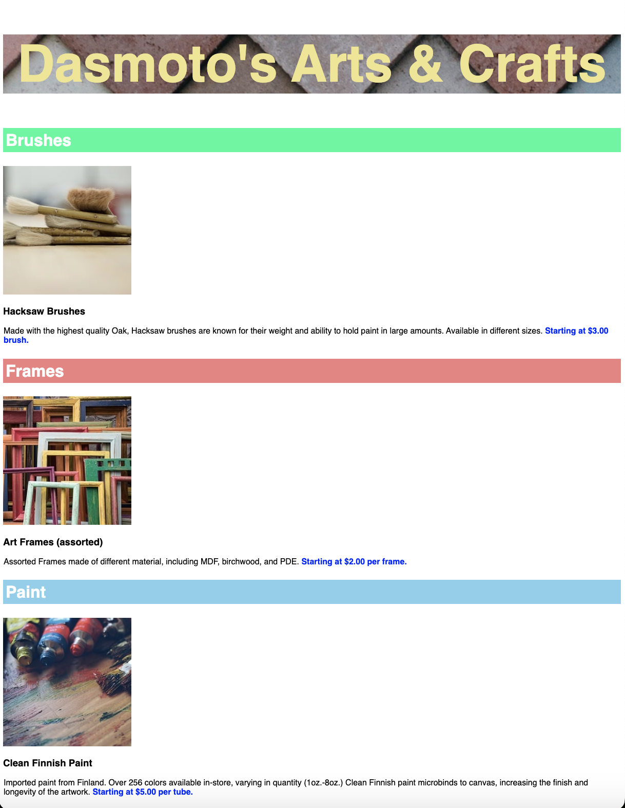

# Dasmoto’s Arts & Crafts website

This is a Codecademy Off-platform Project. Part of their syllabus for the Pro Fullstack Developer Course.

## Table of content

- [Overview] (#overview)
- [Screenshot] (#screenshot)
- [My Links](#my-links)
- [My Process](#my-process)
- [Built with](#built-with)
- [What I learned](#what-i-learned)
- [Continued Development](#contineud-development)
- [Useful Resources](#useful-resources)
- [AI Collaboration](#ai-collaboration)
- [Author](#author)

## Overview

### Screenshot

### My Links

GitHub Dasamoto's Arts & Crafts Repo URL: https://github.com/Drucelle/dasmotos-arts

Github Page Live URL: https://drucelle.github.io/dasmotos-arts/

## My Process

### Built with

Semantic HTML
CSS

### What I learned

Semantic HTML
CSS Custom Properties and Variables
Git
Line command in zsh
Connect VS Code to GitHub
Create Page on GitHub

### Continued Development

It is my intention to practise with Markdown and deepen my understanding of git and line command.

### Useful Resources

To write my README.md https://www.frontendmentor.io/articles/the-benefits-of-writing-a-good-challenge-readme-3EIwMaYVgz

For Markdown: https://www.markdownguide.org/

### AI Collaborations

Through this project I have worked with Claude to guide me whenever I got really stuck by asking me questions that pointed me into the right direction. Not by giving me code to copy paste as that would defeat the purpose. 

I thought it was great as it felt I was not working on my own.

## Author

Drucelle
